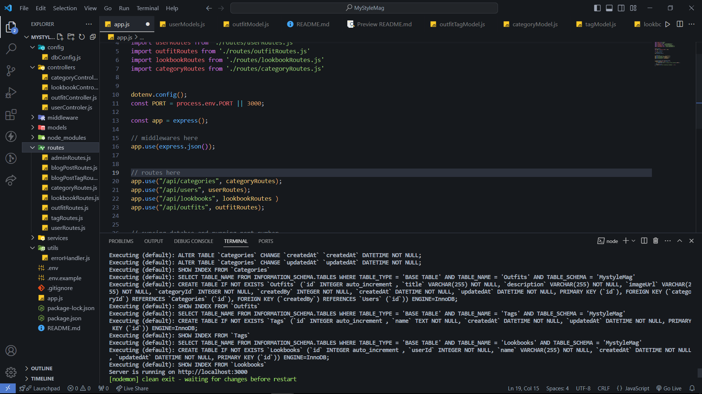

# GROUP 15 BACKEND DEVELOPMENT COLLABORATIVE PROJECT

# MyStyleMag - Fashion Inspiration Platform 🔥

  
  
  
  
  

## Current Implementation Status

**Completed Features:**
- Basic MySQL database connection
- Created Category table, User table, Outfits table and Lookbook table
- Created routes endpoints for adding Users, Outfits, Lookbook and Category into database,
- Lookbook model Structure
- Category model structure with Create operation
- Outfit Model Structure
- Routes folder basic structure

**Features In Progress**
- Creating basic routes for the different http request

## Getting Started
### Prerequisites
- Node.js 18+
- MySQL 8.0+
- Git and Github

### Installation
1. Clone the repository:
` bash
 git clone https://github.com/emmyboy1-pixel/IMAGE-UPLOAD-DATABASE.git
 cd MyStyleMag

2. Install dependencies
  npm install

3. Set up environment
  .env.example .env
  # Edit .env with your dabase credentials

3. Start the Server
  npm run dev

# TEAM COLLABORATION GUIDE
## Workflow Rules
1. Always create a new branch for your task
  git checkout -b feature/your-feature-name
  #### Example
  git checkout -b feature/outfitrecommendations

2. Commit often with clear messages. example
  git commit -m "Created basic database connection, setup the different folder structures and created basic routes example to follow and code along

3. Before pushing, pull latest changes:
  git pull origin main

4. Test your code before creating a Pull Request

5. Request review from at least one team member before merging

## CONFLICT PREVENTION

1. Communication is the key. What so ever you are working on, please let the other team members know

2. Work on separate files when possible

3. Sync daily with "git pull origin main"

4. Resolve conflicts early if they appear

## CODE STANDARDS
1. SEQUELIZE MODELS. 
- Use PascalCase for model names
- Define all associations or relationships in models.index.js

2. CONTROLLERS:
- Follow the async/await pattern
- Always handle errors

3. ENVIRONMENT
- Never commit .env to GitHub
- Use .env.example for reference
 
